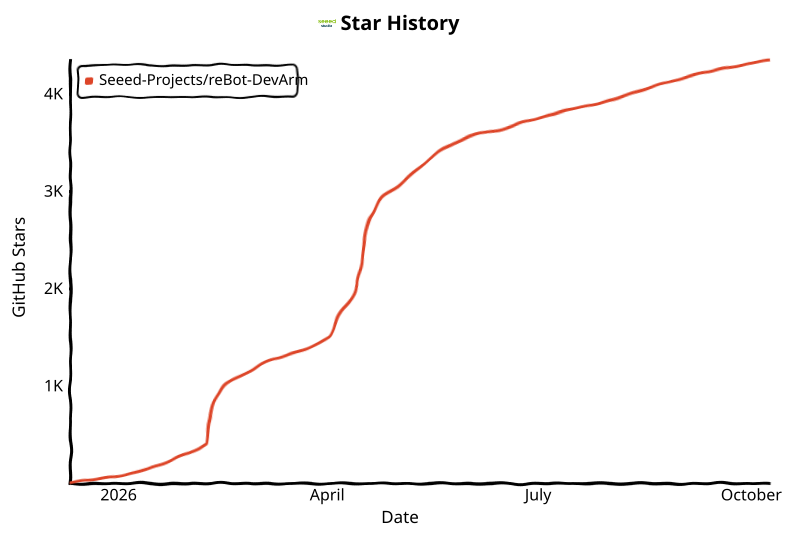

# 🦾 reBot-DevArm

**为每个开发者打造的开源机械臂**

**100% 全开源 · 具身智能 · 软硬一体 · [商用宽松条件请看这里](#权利与限制说明)**

🌐 [落地页](https://279070161-sketch.github.io/reBot/) · 📚 [教程中心](https://wiki.seeedstudio.com/robotics_page/) · ▶ [在线体验](https://yang-ci.github.io/Rebot_Arm_AGV/)

[简体中文](README_zh.md) · [English](README.md) · [日本語](README_JP.md) · [français](README_Fr.md) · [Español](README_es.md)

---

## 📑 目录

- [📖 项目简介](#项目简介)
- [🛒 获取方式](#获取方式)
- [🚀 在线体验](#在线体验)
- [🗺️ 开源路线图](#开源路线图)
- [⚙️ 硬件参数](#硬件参数)
- [🌟 社区项目](#社区项目)
- [🧹 可选硬件](#可选硬件)
- [🎓 全栈机器人生态](#全栈机器人生态)
- [🙌 致谢与贡献者](#致谢与贡献者)
- [📄 许可证](#许可证)
- [☎ 联系我们](#联系我们)

---

## 📖 项目简介

**reBot-DevArm** —— 即 **reBot Arm B601-DM** 与 **reBot Arm B601-RS** —— 是一个致力于降低具身智能学习门槛的机械臂项目。我们主打「真·开源」：不仅是代码，而是无保留地开源一切。

- 🦾 **两款机械臂** —— 提供 **B601-DM（达妙）** 与 **B601-RS（灵足）** 两款外观一致的机械臂全部开源文件
- 🛠️ **硬件图纸** —— 钣金件、3D 打印件源文件
- 🔩 **BOM 清单** —— 详细到每一颗螺丝的规格与购买链接
- 💻 **软件与算法** —— Python SDK、ROS1/2、Isaac Sim、LeRobot 等

## 🛒 获取方式

| 型号 | 购买渠道 |
| :--- | :--- |
| **reBot Arm B601-DM** | 🛒 [淘宝矽递科技旗舰店](https://detail.tmall.com/item.htm?abbucket=15&id=1042412233386&mi_id=0000BiQLUzyi99wQf6g6cKZaF_mOtz3BclXOLpZSNYOSa_A&ns=1&priceTId=2147851217842576937748715e0e71&skuId=6073790464610&spm=a21n57.1.hoverItem.1&utparam=%7B%22aplus_abtest%22%3A%222dd086a2f4fdb8f473c4837ae8ea1f7f%22%7D&xxc=taobaoSearch) |
| **reBot Arm B601-RS** | 🛒 [淘宝矽递科技旗舰店](https://detail.tmall.com/item.htm?abbucket=15&id=1057521963559&mi_id=0000h2A59R8gsL5UdF6Je_CGKUavZ7ORqUN5uHCrlml9-dg&ns=1&priceTId=2147815217842579872861861e0e43&skuId=6267129098361&spm=a21n57.1.hoverItem.2&utparam=%7B%22aplus_abtest%22%3A%2219518482a8df5e898e7492d6c9e35c5e%22%7D&xxc=taobaoSearch) |

### B601-DM 套件方案

DM 版本提供五种套件方案：

- **机械臂本体电机套件** —— 仅含机械臂所需的电机与线束
- **机械臂本体结构件套件** —— 仅含机械结构零部件
- **夹持器完整套件** —— 含夹持器的电机、线束及结构件
- **整机完整套件** —— 含机械臂本体与夹持器全套组件
- **成品组装机械臂** —— 已完成组装的成品机械臂

> 💡 SeeedStudio 套件默认不含电源适配器与 C 型木工夹，这是考虑到大家可能会用电池供电或 DIY 底座固定。可单独购买电源，或参考 [BOM 底部的明纬电源方案](./hardware/reBot_B601_DM/readme_zh.md#关于电源)。

### B601-RS 套件方案

RS 版本提供两种套件方案：

- **完整套件** —— 含机械臂主体与夹爪全套散件
- **预装版机械臂** —— 整机已组装完成

> 💡 强烈建议 RS 版本搭配 [明纬 48V 12.5A 电源](https://item.jd.com/10161209537223.html?pcdk=008mN9TrQ6PYFhXUTEM-B4KF5Q7Yc1ZcUlPyV2_Sl5Kf19Tr48gwCSd8OBwTR8sC.rQ4a.tlbT&spmTag=YTAyNDAuYjAwMjQ5My5jMDAwMDQwMjcuMSUyM3NrdV9jYXJkJTQwMTc4MTYxMTAyODQwNiUyMzE3NTAwNjczMzc4MzgxNzg2NTc2MTE1JTIzMjAzMTA0NjkzMw#switch-sku) 使用；若想输出更强动力、发挥全部性能，可选用 48V 25A 电源适配器。

### 主臂（Leader Arm，可选）

可选购 [主臂 Leader Arm](https://www.seeedstudio.com/Star-Arm-102-p-6765.html?qid=P2U7IG_yskyak5m_1776415593315) 与 [12V 10A 电源](https://www.seeedstudio.com/FY1209900-12V-10A-Power-Adapter-12V-10A-p-6496.html)；亦可使用 SO-ARM101 的 12V DC 电源适配器为主臂供电。

## 🚀 在线体验

无需安装，直接在浏览器体验 reBot Arm B601-RS 的 MuJoCo 数字孪生。可切换标准机械臂与 AGV 配置、控制关节与 TCP、查看全局相机与 D405 腕部相机，并运行自动归位抓取与叠叠乐演示。首次加载模型资源可能需要片刻，建议使用 Chrome 或 Edge。

  <a href="https://yang-ci.github.io/Rebot_Arm_AGV/"><strong>▶ 立即启动 reBot Arm 在线交互演示</strong></a>

## 🗺️ 开源路线图

我们承诺持续维护并适配主流的机器人开发生态。以下为当前适配进度与发布计划。

### reBot Arm B601-DM

| 适配生态 | 状态 | 说明 | 相关文档 |
| :--- | :---: | :--- | :--- |
| 电机基本使用 | ✅ 完成 | 基础运动控制与 API 封装 | [达妙科技](https://wiki.seeedstudio.com/cn/damiao_series/) |
| STEP 3D 结构件及 BOM 开源 | ✅ 完成 | 新版全部零件 STEP 文件、BOM 及加工件参考价格 | [reBot Arm B601-DM BOM](./hardware/reBot_B601_DM/readme_zh.md) |
| 真机性能测试参考 | ✅ 完成 | 常规与极限工况下的机械臂性能参考 | [Performance Testing](./hardware/reBot_B601_DM/performance_testing/Performance_Testing_zh.md) |
| 组装视频 | ✅ 完成 | 超详细的组装步骤与视频 | [快速入门](https://wiki.seeedstudio.com/cn/rebot_b601_dm_getting_started/) |
| Python SDK | ✅ 完成 | 一站式集成 Robstride、达妙、脉塔、高擎、Hexfellow 等电机的读写与控制 | [Motorbridge 教程](https://motorbridge.seeedstudio.com) · [Web UI](https://rebot-devarm.w0x7ce.eu/) |
| ROS2 集成 | ✅ 完成 | ROS2 机械臂控制器，支持运动学、轨迹规划与重力补偿 | [ROS2 教程](https://wiki.seeedstudio.com/cn/rebot_arm_b601_dm_ros2_integration/) |
| Pinocchio 适配 | ✅ 完成 | 适配 Pinocchio，实现正逆运动学与重力补偿 | [Pinocchio 指南](https://wiki.seeedstudio.com/cn/rebot_arm_b601_dm_pinocchio_meshcat/) · [代码](https://github.com/Seeed-Projects/reBotArm_control_py) |
| Isaac Sim 仿真 | ✅ 完成 | 导入 USD 模型并实现仿真遥操作 | [Wiki](https://wiki.seeedstudio.com/rebot_arm_b601_dm_isaacsim/) |
| LeRobot 适配 | ✅ 完成 | 适配 Hugging Face LeRobot 训练框架 | [LeRobot 教程](https://wiki.seeedstudio.com/cn/rebot_arm_b601_dm_lerobot/) |
| 深度相机集成 | ✅ 完成 | 基于 YOLO 与深度相机的视觉夹取演示 | [视觉夹取 Demo](https://wiki.seeedstudio.com/cn/rebot_arm_b601_dm_grasping_demo/) |
| reSpeaker 语音集成 | ✅ 完成 | 加入 reSpeaker Flex 4 麦克风阵列，构建具备空间感知的语音控制 | [语音控制](https://wiki.seeedstudio.com/cn/control_rebot_arm_using_voice_with_respeaker_flex/) |
| 逐步更新最新算法 | ⏳ 计划中 | 逐步更新主流算法 | 持续进行 |
| 推出系列免费课程 | ⏳ 计划中 | 逐步上线完全免费的系列课程 | 持续进行 |

### reBot Arm B601-RS

| 适配生态 | 状态 | 说明 | 相关文档 |
| :--- | :---: | :--- | :--- |
| 电机基本使用 | ✅ 完成 | 基础运动控制与 API 封装 | [灵足时代](https://wiki.seeedstudio.com/cn/robstride_control/) |
| STEP 3D 结构件及 BOM 开源 | ✅ 完成 | 新版全部零件 STEP 文件、BOM 及加工件参考价格 | [reBot Arm B601-RS BOM](./hardware/reBot_B601_RS/README_zh.md) |
| 快速上手 | ✅ 完成 | B601-RS 快速上手教程 | [Wiki](https://wiki.seeedstudio.com/cn/rebot_b601_rs_getting_started/) |
| 组装视频 | ✅ 完成 | 超详细的组装步骤与视频 | [Wiki](https://wiki.seeedstudio.com/cn/rebot_b601_rs_getting_started/) |
| ROS2 (Humble) | ✅ 完成 | ROS2 控制器，支持运动学、轨迹规划、重力补偿与 MoveIt2 | [ROS2 教程](https://wiki.seeedstudio.com/cn/rebot_arm_b601_rs_ros2_integration/) |
| LeRobot 适配 | ✅ 完成 | 适配 Hugging Face LeRobot 训练框架 | [LeRobot 教程](https://wiki.seeedstudio.com/cn/rebot_arm_b601_rs_lerobot/) |
| Pinocchio 适配 | ✅ 完成 | 适配 Pinocchio，实现正逆运动学与重力补偿 | [Pinocchio 指南](https://wiki.seeedstudio.com/cn/rebot_arm_b601_rs_pinocchio_meshcat/) · [代码](https://github.com/Seeed-Projects/reBotArm_control_py) |
| 深度相机集成 | ✅ 完成 | 基于 YOLO 与深度相机的视觉夹取演示 | [视觉夹取 Demo](https://wiki.seeedstudio.com/cn/rebot_arm_b601_rs_grasping_demo/) |
| 具身 Agent 架构 | ✅ 完成 | 接收自然语言指令（如「pick up the red block」），自动规划并执行抓取 | [架构设计](https://wiki.seeedstudio.com/cn/wrc_demo_tutorial/) · [源代码](https://github.com/TheMoonAstronaut/wrc.git) |
| Isaac Sim 仿真 | ✅ 完成 | 导入 USD 模型并实现仿真遥操作 | [DLI 课程](https://www.seeedstudio.com/sim-to-real-with-seeed-rebot-and-nvidia-isaac) · [代码](https://github.com/Seeed-Projects/reBot-Isaacsim) |
| 逐步更新最新算法 | ⏳ 计划中 | 逐步更新主流算法 | 持续进行 |
| 推出系列免费课程 | ⏳ 计划中 | 逐步上线完全免费的系列课程 | 持续进行 |

#### 社区贡献

| 对应生态 | 作者 | 说明 | 仓库 |
| :--- | :---: | :--- | :--- |
| iPhone、HEBI Mobile I/O 与 Meta Quest 遥操作 | [@ammarjmahmood](https://github.com/ammarjmahmood) | 移动手机或 Quest 手柄，夹爪随之运动，采用 TidyBot++（CoRL 2024）的相对位姿映射：原生 SwiftUI 与 ARKit iPhone 应用、HEBI Mobile I/O、Quest WebXR 透视模式，200 Hz MIT 驱动、重力前馈、基于官方 RS URDF 的逆运动学与安全联锁。已在 B601-RS 与 iPhone 16 Pro Max 上测试。 | [rebot-phone-teleop](https://github.com/ammarjmahmood/rebot-phone-teleop) |

## ⚙️ 硬件参数

reBot-DevArm 专为桌面级具身智能应用设计，兼顾负载能力与灵活性。

| 参数项 | reBot Arm B601-DM | reBot Arm B601-RS |
| :--- | :--- | :--- |
| 工作负载 | 1.5 kg | **2.5 kg** |
| 推荐工作空间 | 70% 臂展工作空间 | 70% 臂展工作空间 |
| 最大臂展 | 767 mm | **754 mm** |
| 自重 | **约 4.5 kg** | 约 6.7 kg |
| 重复定位精度 | < 0.2 mm | < 0.2 mm |
| 自由度 | 6 DOF + 1 夹爪 | 6 DOF + 1 夹爪 |
| 支持平台/生态 | ROS1、ROS2、LeRobot、Pinocchio、Isaac Sim、Python SDK | ROS1、ROS2、LeRobot、Pinocchio、Isaac Sim、Python SDK |
| 供电电压 | DC 24V | DC 48V |

## 🌟 社区项目

|  |  |  |  |  |
| :---: | :---: | :---: | :---: | :---: |
|  [来自 GEM-4](https://www.kaggle.com/competitions/gemma-4-good-hackathon/writeups/new-writeup-1778618527713) |  [来自 Linyan Fu](https://x.com/Linyan_Fu/status/2056383947341525180) · [Apheth D Almeida](https://x.com/Apheth_DAlmeida/status/2053503164507476096) |  [来自 Dhruv Diddi](https://x.com/DhruvDiddi/status/2046605015008383284) |  [来自 Ed Henderson](https://x.com/ed0henderson/status/2055076839002095743) |  Sameer |
|  [来自 Binh Pham](https://x.com/pham_blnh/status/2061994096374505710) |  [来自 FangTianChongHui](https://www.instagram.com/reel/DY7Ny8OPjVu/?utm_source=ig_web_copy_link&igsh=NTc4MTIwNjQ2YQ==) |  [Xense YaoLin Dong](https://x.com/dong1505lin) |  [来自 Ed Henderson](https://x.com/ed0henderson/status/2055076839002095743) |  [来自 yoshikai_man](https://x.com/yoshikai_man/status/2079938975398244705) |
|  [来自 hei-rebot-lift](https://github.com/lipengdong/hei-rebot-lift) |  [来自 Martin Kemka](https://www.linkedin.com/posts/activity-7484390995862781952-TX4m?utm_source=share&utm_medium=member_desktop&rcm=ACoAAE6WUL4BWkFeyUj0TJ5JlGf6IG4iRHAicUo) |  [来自 Kamil Buczyński](https://www.linkedin.com/posts/kamil-buczy%C5%84ski-102843301_seeedstudio-rebotarm-seeedprojectofthemonth-ugcPost-7485297094715461633-RV_6/?utm_source=share&utm_medium=member_desktop&rcm=ACoAAE6WUL4BWkFeyUj0TJ5JlGf6IG4iRHAicUo) |  [来自 Daniel Dorado](https://www.linkedin.com/posts/doradodaniel_computervision-spatialai-sim2real-share-7474727487374184448-NhwX/?utm_source=share&utm_medium=member_desktop&rcm=ACoAAE6WUL4BWkFeyUj0TJ5JlGf6IG4iRHAicUo) |  [来自 Asier](https://www.linkedin.com/posts/asierarranz_nvidia-physicalai-isaaclab-ugcPost-7480271721942417408-YNwu/?utm_source=share&utm_medium=member_desktop&rcm=ACoAAE6WUL4BWkFeyUj0TJ5JlGf6IG4iRHAicUo) |
|  [来自 H](https://x.com/thermalpastor/status/2103842737032458567) |  [来自 alpha_rover](https://x.com/Alpha10six/status/2103860758559994216) |  [来自 Dilum Sanjaya](https://x.com/DilumSanjaya/status/2102806161728885145) |  [来自 Binh](https://x.com/pham_blnh/status/2101003855731593544) |  [来自 LeRobot](https://x.com/LeRobotHF/status/2104519372333048112) |
|  [来自 Raghav Kumar](https://x.com/raghav2956/status/2104659668375339475) |  [来自 Kamil Buczyński](https://www.linkedin.com/posts/kamil-buczy%C5%84ski-102843301_seeedstudio-ai-agent-ugcPost-7510738285707776000-1SMQ/?utm_source=social_share_send&utm_medium=android_app&rcm=ACoAAE6WUL4BWkFeyUj0TJ5JlGf6IG4iRHAicUo) |  [来自 Fictionlab](https://www.linkedin.com/feed/update/urn:li:activity:7510701008885309440/) |  [来自 box2bridge](https://x.com/seeedstudio/status/2101965998954107303) |  [来自 FangTianChongHui](https://x.com/seeedstudio/status/2095469352976003482) |

   
  <a href="https://www.seeedstudio.com/sim-to-real-with-seeed-rebot-and-nvidia-isaac">Seeed reBot Arm × NVIDIA Isaac —— Sim-to-Real VLA 课程</a>

## 🧹 可选硬件

### 腕部相机支架

| 32×32 UVC 相机 | Intel D435i | Intel D405 & Gemini 305 | Gemini 2 |
| :--- | :--- | :--- | :--- |
| 即将上线 |  |  |  |
| 即将上线 | [STEP 模型文件](hardware/reBot_B601_DM/3D_Printed_Parts/D435_Gemini2_Mount.step) | [STEP 模型文件](hardware/reBot_B601_DM/3D_Printed_Parts/D405_305_Mount.step) · [设计说明](https://github.com/bowenszhu/rebot-b601-rs-d405-wrist-mount/tree/v1.0.0) | [STEP 模型文件](hardware/reBot_B601_DM/3D_Printed_Parts/D435_Gemini2_Mount.step) |

### 兼容主臂（Leader Arm）

| Star Arm 102-LD | 欢迎各类机械臂兼容接入 |
| :--- | :--- |
|  | [系列中心](https://fashionstar.com.hk/robot-arm/star-arm-102/) · [GitHub 仓库](https://github.com/servodevelop/Star-Arm-102) |

### 爪子 DIY

| 柔性手指 | 开放兼容集成拓展 |
| :--- | :--- |
|  | 敬请期待 |
| [手指安装座（ABS/PLA）](hardware/reBot_B601_DM/3D_Printed_Parts/Soft_Gripper_Mount.step) · [柔性手指本体（TPU 95+）](hardware/reBot_B601_DM/3D_Printed_Parts/Soft_Gripper_Finger.step) | 敬请期待 |

### 推荐可选硬件

| 类别 | 类型 | 图片 | 产品 | 链接 |
| :--- | :--- | :--- | :--- | :--- |
| **相机** | 深度相机 |  | **Orbbec Gemini 2 3D Camera** | [Seeed Studio](https://www.seeedstudio.com/Orbbec-Gemini-2-3D-Camera-p-6464.html) |
| **相机** | 深度相机 |  | **Orbbec Gemini 336 Depth Camera** | [Seeed Studio](https://www.seeedstudio.com/Orbbec-Gemini-336-3D-Camera-3D-p-6662.html) |
| **相机** | 深度相机 |  | **Orbbec Gemini 335LG 3D Camera** | [Seeed Studio](https://www.seeedstudio.com/Orbbec-Gemini-335LG-3D-Camera-p-6541.html) |
| **相机** | 深度相机 |  | **SLAMTEC Aurora S** | [Seeed Studio](https://www.seeedstudio.com/SLAMTEC-Aurora-S-AI-Integrated-Spatial-Perception-System-p-6669.html) |
| **相机** | 深度相机 |  | **Intel RealSense Depth Camera D435i** | [Seeed Studio](https://www.seeedstudio.com/Intel-RealSense-Depth-Camera-D435i-p-4423.html) |
| **相机** | 深度相机 |  | **RealSense Depth Camera D405** | [Seeed Studio](https://www.seeedstudio.com/RealSense-D405-3D-Camera-p-6758.html) |
| **相机** | 单目相机 |  | **Sensing SG3S-ISX031C-GMSL2F 3MP GMSL2 Camera** | [Seeed Studio](https://www.seeedstudio.com/SG3S-ISX031C-GMSL2F-p-6245.html) |
| **相机** | 单目相机 |  | **ET-S231 Megapixel 120° 广角 1080P USB 相机** | [Seeed Studio](https://www.seeedstudio.com/ET-S231-120-USB-Camera-p-6683.html) |
| **麦克风** | 麦克风阵列 |  | **reSpeaker Flex XVF3800 Circular-4 with XIAO ESP32S3** | [Seeed Studio](https://www.seeedstudio.com/reSpeaker-Flex-XVF3800-Circular-4-with-XIAO-ESP32S3-p-6739.html) |
| **麦克风** | 麦克风阵列 |  | **reSpeaker XMOS XVF3800** | [Seeed Studio](https://www.seeedstudio.com/ReSpeaker-XVF3800-USB-Mic-Array-p-6488.html) |
| **控制器** | 边缘控制器 |  | **reComputer J3011-Orin Nano 8GB** | [Seeed Studio](https://www.seeedstudio.com/reComputer-J3011-p-5590.html) |
| **控制器** | 边缘控制器 |  | **NVIDIA Jetson AGX Thor Developer Kit** | [Seeed Studio](https://www.seeedstudio.com/NVIDIA-Jetson-AGX-Thor-Developer-Kit-p-9965.html) |

## 🎓 全栈机器人生态

reBot-DevArm 不仅是一个机械臂，更是一个机器人学习社区。我们免费共享以下通用教程：

**🖥️ 边缘计算与主控**

-  —— AI 推理与算力核心
-  —— 通用 Linux 开发环境
- [-0091BD?style=for-the-badge&logo=espressif&logoColor=white)](https://wiki.seeedstudio.com/SeeedStudio_XIAO_Series_Introduction/) —— 低功耗无线控制节点

**📡 传感器与外设**

- **电机舵机** —— [达妙 / 高擎 / 灵足 / 脉塔 / 飞特 / 华馨京](https://wiki.seeedstudio.com/robotics_page/)
- **视觉感知** —— [深度相机 / 激光雷达 / 视觉算法](https://wiki.seeedstudio.com/robotics_page/)
- **听觉交互** —— [reSpeaker 麦克风阵列 / 语音识别 / 空间感知（DoA）](https://wiki.seeedstudio.com/control_rebot_arm_using_voice_with_respeaker_flex/)
- **运动姿态** —— [IMU（6 轴/9 轴）/ 陀螺仪 / 磁力计](https://wiki.seeedstudio.com/Sensor_accelerometer/)
- **综合套件** —— [更多机器人传感器与驱动案例](https://wiki.seeedstudio.com/robotics_page/)

> 👉 **[点击进入 Wiki 知识库](https://wiki.seeedstudio.com/)** —— 所有教程免费查阅。

## 🙌 致谢与贡献者

开源之路从不孤单。reBot-DevArm 的诞生离不开 Seeed Studio 的全力支持、全球开源社区与优秀的硬件合作伙伴。我们向以下项目与团队致以最诚挚的敬意：

**🌍 生态与软件支持**

- [Seeed Studio](https://www.seeedstudio.com/) —— 提供全方位的硬件供应链与技术支持
- [Hugging Face LeRobot](https://github.com/huggingface/lerobot) —— 优秀的端到端机器人学习框架
- [NVIDIA Isaac Sim](https://developer.nvidia.com/isaac/sim) —— 强大的机器人仿真与合成数据平台

**⚙️ 核心硬件伙伴**

- [达妙科技 Damiao Technology](https://www.damiaokeji.com/)
- [灵足时代 Robstride](https://robstride.com/)
- [华馨京科技 Fashion Star](https://fashionrobo.com/)

**💡 致敬先驱项目**

- [SO-ARM100](https://github.com/TheRobotStudio/SO-ARM100/tree/main)
- [Mobile ALOHA](https://github.com/tonyzhaozh/aloha)
- [Dummy-Robot（稚晖君）](https://github.com/peng-zhihui/Dummy-Robot)
- [OpenArm](https://openarm.dev/)
- [I2RT](https://i2rt.com/)
- [TRLC-DK1](https://github.com/robot-learning-co/trlc-dk1)

**🎃 原型机贡献者**

- SeeedStudio AI Robotics Team —— Yaohui Zhu（yaohui.zhu@seeed.cc）
- SeeedStudio STU —— Wentao Dong
- SeeedStudio STU —— Weiwei Xu
- SeeedStudio Purchasing Department —— Fengqun Peng

**👥 贡献者**

*即将上线…… 欢迎提交 PR 成为贡献者！*

### ⭐ Star 趋势

<picture>
  <source media="(prefers-color-scheme: dark)" srcset="assets/star-history/star-history-dark.svg">
  <source media="(prefers-color-scheme: light)" srcset="assets/star-history/star-history-light.svg">
  
</picture>

## 📄 许可证

- **硬件设计** © 2026 深圳矽递科技股份有限公司（SeeedStudio），基于 [CERN-OHL-W-2.0](https://ohwr.org/cern_ohl_w_v2.txt) 开源
- **固件代码** © 2026 深圳矽递科技股份有限公司（SeeedStudio），基于 [Apache-2.0](https://www.apache.org/licenses/LICENSE-2.0) 开源

### 权利与限制说明

reBot Arm 机械臂项目始终秉持「敏捷、开放、担当、共生」的核心理念服务广大开发者，愿景是让每一位爱好者都能借助 reBot 系统掌握机械臂硬件架构与软件底层原理，沉浸式体验具身智能前沿算法。

项目上线初期一直采用 **CC BY-SA NC 非商用开源协议**，让所有开发者与贡献者在产品尚未成熟的阶段专注迭代完善，不受商业诉求干扰。历经 SeeedStudio 数月的产品打磨与技术沉淀，**自 2026 年 5 月 11 日起**，项目正式由 CC BY-SA NC 升级切换为 **CERN-OHL-W 2.0 开源协议**，实现软硬件全链路 100% 开源，开放全场景商业合规使用权限。

本项目硬件与软件使用不同开源许可协议，使用前请确认所用部分对应的许可条款。

| 项目 | 硬件（CERN-OHL-W-2.0） | 软件 SDK（Apache-2.0） |
| :--- | :--- | :--- |
| ✅ 允许商用 | ✅ 允许 | ✅ 允许 |
| ✅ 允许修改 | ✅ 允许 | ✅ 允许 |
| ✅ 允许分发 | ✅ 允许 | ✅ 允许 |
| ✅ 允许闭源集成/再发布 | ❌ 有条件闭源（详见 [CERN-OHL-W-2.0](https://ohwr.org/cern_ohl_w_v2.txt)） | ✅ 允许（无需公开修改代码） |
| ⚠️ 保留版权声明 | ✅ 必须保留 | ✅ 必须保留 |
| ⚠️ 保留许可证原文 | ✅ 必须保留 | ✅ 必须保留 |
| ⚠️ 修改需注明 | ✅ 必须注明修改及日期 | ✅ 修改文件需注明修改内容 |
| ⚠️ 专利授权 | ✅ 明确专利授权 | ✅ 明确专利授权 |
| ⚠️ 分发时提供源码 | ✅ **必须**提供硬件「完整源」（Complete Source） | ❌ 无强制提供源码要求 |
| ⚠️ 对外部/闭源模块兼容 | ✅ 允许（Weakly Reciprocal 特性） | ✅ 完全允许 |
| 🔗 与其他组件关系 | 独立接口模块（External Material）可保持原许可闭源 | 无限制，可链接任意许可证代码库 |
| 📄 官方许可证全文 | [CERN-OHL-W-2.0](https://ohwr.org/cern_ohl_w_v2.txt) | [Apache-2.0](https://www.apache.org/licenses/LICENSE-2.0) |

## ☎ 联系我们

- **开源进度 & 技术支持** —— 耀晖：yaohui.zhu@seeed.cc
- **未来合作 & 轻量化定制** —— Elaine：elaine.wu@seeed.cc
